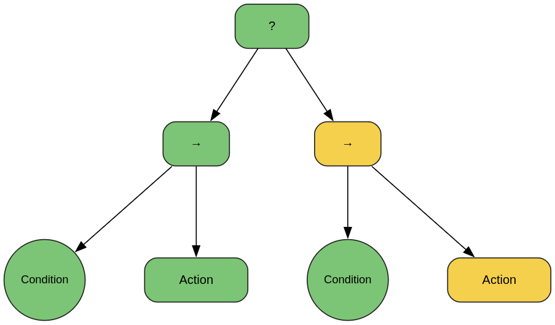

# task_planning_tools
This repository provides various tools for implementing task planning architectures. Some examples of implementation are provided in the repository: [pybullet-planning](https://github.com/sheriffMelamine/pybullet-planning)

---
## Behavior Trees
The `behavior_tree.py` code involves some classes and functions to facilitate implementation of behavior trees in PyBullet based robot simulation environment using `py_trees`.  

  

The `CommandBehavior` class can create commands for execution. It basically sends a command for a robot action and takes the status `RUNNING`, and updates the status to `SUCCESS` when the task completes. Some data structures are used in the class for the communication between environment loop and behavior tree loop, such as `command_queue` and `status_dict`. This is basically the **Action Node** of the behavior tree.  

The `ConditionBehavior` similarly represents the **Condition Node**, which checks a given condition and returns `SUCCESS` if it satisfies, otherwise, it returns `RUNNING`.  

The `BehaviorTreePlan` abstract class has methods necessary for implementation of behavior tree for the robot. The user has to create a subclass defining the `create_tree` function to define how the tree would work, and other necessary methods and properties are predefined in the abstract class.  

There are some other functions defined for doing operations with multiple trees, such as `merged_loop` and `are_all_trees_done`.
